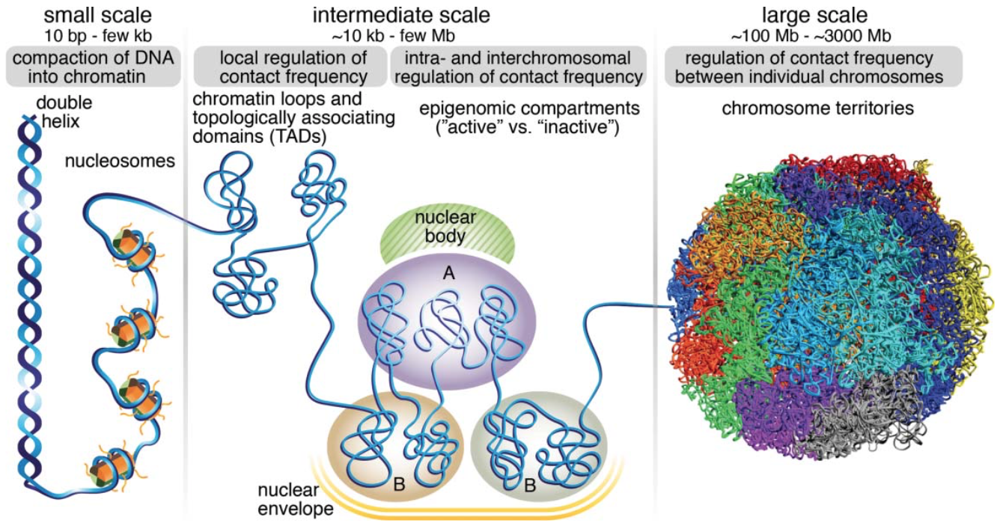

```{r xaringan-themer, include = FALSE}
library(xaringanthemer)
library(icons)
mono_light(
  base_color = "midnightblue",
  header_font_google = google_font("Noto Sans"),
  text_font_google   = google_font("Montserrat", "500", "500i"),
  code_font_google   = google_font("Droid Mono"),
  link_color = "#8B1A1A", #firebrick4, "deepskyblue1"
  text_font_size = "28px",
  code_font_size = "26px"
)
```

class: center, middle

### preciseTAD: A transfer learning framework for 3D domain boundary prediction at base-pair resolution

[bit.ly/preciseTAD](https://mdozmorov.github.io/Talk_preciseTAD/)

Mikhail Dozmorov, Ph.D.    
Associate professor, Department of Biostatistics  
Virginia Commonwealth University   

<div class="my-footer">
<a href="https://dozmorovlab.github.io/"> `r icons::fontawesome("id-card", style = "solid")` dozmorovlab.github.io</a> | 
<a href="https://github.com/mdozmorov"> `r icons::fontawesome$brands$github` mdozmorov</a> | 
<a href="https://twitter.com/mikhaildozmorov"> `r icons::fontawesome$brands$twitter` @mikhaildozmorov</a>
</div>

---
## The 3D structure of the genome

- Human genome is big - ~3.2 billion base pairs
- ~4 meters (~12ft) of diploid genome is packed into ~10um nucleus
- ~800 trips from Earth to Sun in ~30T cells from the human body

.center[]

<div style="font-size: small;"> 

Human body has approximately 30 trillion human cells (excluding trillions of microbiome cells); Stretched haploid genome would be roughly 2 meters - each cell has 4 meters of DNA (1 m = 3.28 ft); 30 trillion * 4 meters = 120 trillion meters; Convert to miles: 120 trillion meters / 1609.34 = 7.45*10^{10}; Convert to Earth-Sun distance: 7.45*10^{10} / 91.43*10^6 = 814.83
</div>

---
## Topologically Associating Domains (TADs) and chromatin loops

- **TADs** – regions of increased chromatin interactions, separated by insulating boundaries
- **Loops** – points of enriched chromatin contacts, represented as high-intensity adjacent pixels on Hi-C maps
- Binding of CTCF and the members of cohesin complex (RAD21, SMC3) are a defining feature of domain boundaries

.center[]

.small[Goloborodko et al. 2016 “Chromosome Compaction by Active Loop Extrusion.”]

---
## Pitfalls of existing TAD/loop callers

- Detect domains from Hi-C chromatin interaction matrices
- Heavily reliant on Hi-C data _resolution_ - the size of genomic regions used to bin the genome for measuring interaction frequency (1-100kb)
- Ignore the fundamental role of CTCF and other genome annotation data in domain formation

.center[]

---
## Transcription factor enrichment at domain boundaries

- **Arrowhead** – an algorithm for finding contact domains
- **Peakachu** – a machine learning framework for chromatin loop detection
- **SpectralTAD** - Hierarchical TAD detection using spectral clustering
- **Grubert** – experimentally obtained cohesin-mediated loops (ENCODE III)

.center[]

.small[ Rao et al. 2014, “A 3D Map of the Human Genome at Kilobase Resolution Reveals Principles ...”  
Salameh et al. 2020 “A Supervised Learning Framework for Chromatin Loop Detection ...”  
Cresswell et al. 2020, “SpectralTAD: an R package for defining a hierarchy of topologically ...”  
Grubert et al. 2020, “Landscape of Cohesin-Mediated Chromatin Loops in the Human Genome.”  ]

---
## Improving domain boundary detection using genome annotation data

- **Previous work:** using genome annotation data to predict enhancer-promoter interactions, genomic rearrangements (e.g., _3DPredictor_), Hi-C contact maps (e.g., _HiC-Reg_), and domain boundaries (e.g., _Lollipop_)

- **Limitations:** Operating at the resolution of Hi-C data, region size 1-100 kb

- **Hypothesis:** High-resolution genome annotation data can inform more precise location of domain boundaries

.small[ Tao, Huan, et al. “**Computational Methods for the Prediction of Chromatin Interaction and Organization Using Sequence and Epigenomic Profiles**,” _Briefings in Bioinformatics_, 2021 - Review of 48 chromatin interaction prediction methods using sequence and genome annotations.

Belokopytova P. & Fishman V. “**Predicting Genome Architecture: Challenges and Solutions.**” _Frontiers in Genetics_, 2021 - Review of chromatin architecture reconstruction using genome annotation data, biophysical and statistical/machine learning approaches ]

---

**preciseTAD** – learning boundary-transcription factor associations at the Hi-C resolution, transferring the learned associations at the base-pair resolution (predict the probability of each base being a boundary, cluster with DBSCAN, PAM)

.center[]

---
## Feature engineering, class imbalance

.pull-left[ 
.center[]
]

.pull-right[ 
.center[]
]

Distance between boundary-annotation, random undersampling, 5kb resolution Hi-C data perform best

---
## preciseTAD definitions

- Trained on either _Arrowhead_ or _Peakachu_ detected boundaries

- Genome annotation data from ENCODE (Transcription factor binding sites, histone modifications, chromatin segmentation data)

- preciseTAD detects 
    - **PTBRs**, _preciseTAD Boundary Regions_, regions enriched in bases with high boundary probability, DBSCAN
    - **PTBPs**, _preciseTAD Boundary Points_, most likely boundary summit points, PAM

---

<div style="float: left; width: 70%;">
<center></center>
</div>

<div style="float: right; width: 30%;">

<div>A) Transcription factors (TFs) provide the best predictive power</div>
<br>
<div>B) 4-8 TFs are sufficient for optimal prediction</div>
<br>
<div>C) CTCF, RAD21, SMC3, ZNF143 transcription factors are most important predictors for all chromosomes</div>
<br>
<div>D) preciseTAD-predicted boundaries are closer to CTCF binding sites</div>

</div>

---
## preciseTAD-predicted boundaries strongly enriched in CTCF and and other architectural proteins

.center[]

---
## preciseTAD-predicted domains resemble Grubert experimental data

Size distribution
.center[]

---
## preciseTAD-predicted domains resemble Grubert experimental data

Size distribution
.center[]

CTCF orientation
.center[]

---
## preciseTAD- and Lollipop-predicted boundaries similarly enriched in CTCF and other architectural proteins

.center[]

---
## Summary

- Current TAD/loop callers focus more on visual Hi-C data characteristics and less on the underlying biology

- preciseTAD learns boundary-genomic annotation associations at the Hi-C data resolution and transfers this knowledge to the base-pair level

- Binding of four transcription factors (CTCF, RAD21, SMC3, ZNF143) is sufficient to improve domain boundary detection

- Models trained in one cell type can accurately predict boundaries in another cell type without Hi-C data
    - We predicted boundaries for 60 cell lines, imputing missing genomic annotations with Avocado (ongoing)

.small[ Stilianoudakis S, Marshall M, Dozmorov M. "**preciseTAD: A transfer learning framework for 3D domain boundary prediction at base-pair resolution**." bioRxiv (2021). https://doi.org/10.1101/2020.09.03.282186
]


---
class: center, middle

# Thank you

<br> 

Stilianoudakis S, Marshall M, Dozmorov M. "**preciseTAD: A transfer learning framework for 3D domain boundary prediction at base-pair resolution**." bioRxiv (2021)

https://bioconductor.org/packages/preciseTAD/

https://dozmorovlab.github.io/preciseTAD/


.small[ The George and Lavinia Blick Research Fund

[bit.ly/preciseTAD](https://mdozmorov.github.io/Talk_preciseTAD/) ]

<div class="my-footer">
<a href="https://dozmorovlab.github.io/"> `r icons::fontawesome("id-card", style = "solid")` dozmorovlab.github.io</a> | 
<a href="https://github.com/mdozmorov"> `r icons::fontawesome$brands$github` mdozmorov</a> | 
<a href="https://twitter.com/mikhaildozmorov"> `r icons::fontawesome$brands$twitter` @mikhaildozmorov</a>
</div>


<!--
## Interpretation of differentially interacting chromatin regions (DIRs)

- **Visualization of DIRs.** A Manhattan-like plot of DIRs may inform us about abnormalities or reveal chromosome site-specific enrichment of differentially interacting regions

.center[]


## Interpretation of differentially interacting chromatin regions (DIRs)

- **Overlap between differentially expressed genes and DIRs.** If gene expression measurements are available, differentially expressed genes may be tested for overlap with DIRs - test the link between DIRs and changed gene expression

- **Functional enrichment of genes overlapping DIRs.** DIRs may disrupt specific pathways/functions - test whether genes overlapping DIRs are enriched in a canonical pathway or share a common function


## Interpretation of differentially interacting chromatin regions (DIRs)

- **Overlap enrichment between TAD boundaries and DIRs.** DIRs may correspond to TAD boundaries that are deleted or created - test DIRs for significant overlap with TAD boundaries detected in either condition or only in boundaries changed between the conditions

- **Overlap between DIRs and transcription factor binding sites.** DIRs may correspond to the locations where proteins bind to DNA, such as CTCF sites - test for enrichment of DIRs in any genome annotation (epigenomic mark)


## Interpretation of differentially interacting regions

.pull-left[ .center[] ]

.pull-right[ .center[] ]

.small[ Stansfield, John C., Duc Tran, Tin Nguyen, and Mikhail G. Dozmorov. “[R Tutorial: Detection of Differentially Interacting Chromatin Regions From Multiple Hi-C Datasets](https://doi.org/10.1002/cpbi.76)” _Curr Prot in Bioinformatics_, May 24, 2019
]

class: center, middle

# preciseTAD


## Machine learning for TAD boundary prediction

.pull-left[ 
- **preciseTAD** – a random forest model using genomic annotations for predicting the probability of each base being a boundary

- Train a model on low-resolution Hi-C regions - binary classification of annotated boundary/non-boundary regions

- Apply the model to each annotated base - predict the likelihood of a base being a boundary

]

.pull-right[ .center[] 
]

.small[ Stilianoudakis, Spiro C. “[PreciseTAD: A Machine Learning Framework for Precise 3D Domain Boundary Prediction at Base-Level Resolution](https://doi.org/10.1101/2020.09.03.282186)” _bioRxiv_ Sept 29, 2020]


## Machine learning for TAD boundary prediction

.pull-left[ 

- Different resolutions (5kb)

- Four feature engineering techniques (distance)

- Four approaches to class imbalance (RUS or SMOTE)

- Three types of genome annotations (Transcription factors (CTCF, SMC3, RAD21, ZNF143), Histone modifications, Chromatin states)
]

.pull-right[ .center[] 
]

.small[ Stilianoudakis, Spiro C. “[PreciseTAD: A Machine Learning Framework for Precise 3D Domain Boundary Prediction at Base-Level Resolution](https://doi.org/10.1101/2020.09.03.282186)” _bioRxiv_ Sept 29, 2020]


## Machine learning for TAD boundary prediction

.pull-left[ 
- DBSCAN clustering and PAM to identify boundary regions and summit points  

- Summits are highly enriched in CTCT et al. signal

- Pre-trained models predict boundaries using only genome annotation data 

.small[ Stilianoudakis, Spiro C. “[PreciseTAD: A Machine Learning Framework for Precise 3D Domain Boundary Prediction at Base-Level Resolution](https://doi.org/10.1101/2020.09.03.282186)” _bioRxiv_ Sept 29, 2020]
]

.pull-right[ .center[] 
]
-->
